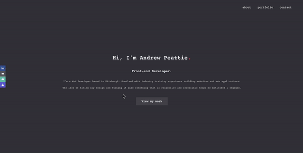

# Portfolio
> This project was created to showcase some of my projects i have worked on for the past year. It's a minimalist design where I kept the UI as clear as possible.

## Table of Contents
* [Technologies Used](#technologies-used)
* [Screenshots](#screenshots)
* [Setup](#setup)
* [Project Status](#project-status)


## Technologies Used
* [Create React App](https://github.com/facebook/create-react-app)
* [Javascript](https://www.javascript.com/)
* [Framer Motion](https://www.framer.com/motion/)
* [React Router](https://reactrouter.com/)


## Screenshots



## Setup
```
npm install
```

```
npm start
```
Runs the app in the development mode.

Open http://localhost:3000 to view it in the browser.


## Project Status
Project is: _no longer being worked on_ ( I have created a different portfolio )

